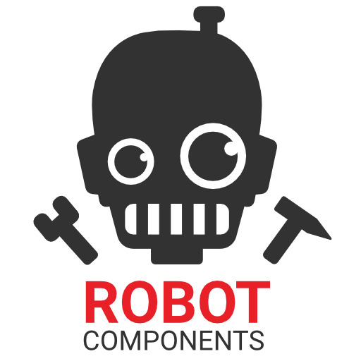

<p align="center">
  
</p>

<p align="center">
  
  
  
  
  
  <a href="https://doi.org/10.5281/zenodo.5773814"></a>
</p>

---

Robot Components is a plugin for intuitive robot programming for ABB robots inside of Rhinoceros Grasshopper. Robot Components offers a wide set of tools to create toolpaths, simulate robotic motion and generate RAPID code within Grasshopper. Some of the main features include:

- 40+ predefined ABB robot models
- Possibility to add your own robot models
- Support for external axes (both linear and rotational)
- Possibility to define custom strategies for all external axis values
- Support for work objects (including movable work objects)
- Efficient forward and inverse kinematics
- Possibility to add your own custom code lines
- Real-time connection with IRC5 controllers
- [Robot Components API](https://robotcomponents.github.io/RobotComponents-API-Documentation/index.html) to develop your custom components using either Python or C#

## Getting Started
You can download the latest release directly from this repository's [releases page](https://github.com/RobotComponents/RobotComponents/releases) or from [Food4Rhino](https://www.food4rhino.com/app/robot-components). Unzip the downloaded archive and copy all files in the Grasshopper Components folder (in GH, File > Special Folders > Components Folder). Make sure that all the files are unblocked (right-click on the file and select Properties from the menu. Click Unblock on the General tab). Restart Rhino and you are ready to go! If you use Rhino 7 you can also install Robot Components via the package manager. 

In case you want to use the components from the Controller Utility section you additionally have to install [Robot Studio](https://new.abb.com/products/robotics/robotstudio) or the ABB Robot Communication Runtime (you can download it by clicking [here](https://github.com/RobotComponents/RobotComponents/raw/master/Utility/ABB%20Robot%20Communication%20Runtime%207.0.zip)). The current release is built and tested against the ABB PC SDK version 2020.1 (ABB Robot Communication Runtime 7.0). We do not guarantee that the Controller Utility components work with older versions of the ABB Robot Communucation Runtime. Please contact us if you have problems with establishing a real-time connection from Grasshopper.

You can find a collection of example files demonstrating the main features of Robot Components in this repository in the folder [Example Files](https://github.com/RobotComponents/RobotComponents/tree/master/ExampleFiles). You can find the Grasshopper documentation website [here](https://robotcomponents.github.io/RobotComponents-Documentation/). The documentation website of the API [here](https://robotcomponents.github.io/RobotComponents-API-Documentation/index.html).

For easy sharing of the download link and the documentation (with e.g. students) you can also use our [linktree](https://linktr.ee/RobotComponents).

## Credits


Robot Components is an open source project initiated by the chair of [Experimental and Digital Design and Construction of the University of Kassel](https://www.uni-kassel.de/fb06/institute/architektur/fachgebiete/experimentelles-und-digitales-entwerfen-und-konstruieren/home). The developers and contributors are listed [here](https://github.com/RobotComponents/RobotComponents/blob/master/AUTHORS.md).

Robot Components uses the ABB PC SDK for real-time connection to ABB Robots, you can find the SDK used in this project [here](https://developercenter.robotstudio.com/pc-sdk).

We would like to acknowledge [Jose Luis Garcia del Castillo](https://github.com/garciadelcastillo) and [Vicente Soler](https://github.com/visose) for making their Grasshopper plugins [RobotExMachina](https://github.com/RobotExMachina) and [Robots](https://github.com/visose/Robots) available. Even our approach is different it was helpful for us to see how you implemented certain functionalities and approached certain issues. 

## Known Issues
Known issues are listed [here](https://github.com/RobotComponents/RobotComponents/issues). If you find a bug, please help us solve it by filing a [report](https://github.com/RobotComponents/RobotComponents/issues/new).

## Roadmap
Please have a look at the open [issues](https://github.com/RobotComponents/RobotComponents/issues) and [projects](https://github.com/RobotComponents/RobotComponents/projects) to know on what we are currently working and what we want to add and change in the future.  

## Contribute
**Bug reports**: Please report bugs at our [issue page](https://github.com/RobotComponents/RobotComponents/issues). 

**Feature requests**: Feature request can be proposed on our [issue page](https://github.com/RobotComponents/RobotComponents/issues). Please include how this feature should work by explaining it in detail and if possible by adding relevant documentation (from e.g. ABB). 

**Code contributions**: We accept code contributions through [pull requests](https://help.github.com/en/github/collaborating-with-issues-and-pull-requests/about-pull-requests). For this you have to [fork](https://help.github.com/en/github/getting-started-with-github/fork-a-repo) or [clone](https://help.github.com/en/github/creating-cloning-and-archiving-repositories/cloning-a-repository) this repository. To compile the code all necesarry references are placed in the folder [DLLs](https://github.com/RobotComponents/RobotComponents/tree/master/DLLs). We only accept code constributions if they are commented. We use XML comments to auto generate our API documentation. You can read more about this topic [here](https://docs.microsoft.com/en-us/dotnet/csharp/codedoc). If you want to make a significant contribution, please let us know what you want to add or change to avoid doing things twice. For questions or if you want to discuss your constribution you can reach out to one of the [developers](https://github.com/RobotComponents/RobotComponents/blob/master/AUTHORS.md). Feel free to add your name to the list with [contributors](https://github.com/RobotComponents/RobotComponents/blob/master/AUTHORS.md) before you make a pull request.

**Adding support for other brands**: Robot Components is developed to intuitive program ABB robots inside Grasshopper. At the moment we have no plans to implement the support for other robot brands. However, we have a few ideas about how to implement this and since we want to keep Robot Components as intuitive as possible we kindly ask you to contact one of the [developers](https://github.com/RobotComponents/RobotComponents/blob/master/AUTHORS.md) first in case if you want to implement other robot brands. We are happy to contribute to and support this development.

## Cite Robot Components
Robot Components is a free to use Grasshopper plugin and does not legally bind you to cite it. However, we have invested time and effort in creating Robot Components, and we would appreciate if you would cite if you used. Please use our [DOI from Zenodo](https://doi.org/10.5281/zenodo.5773814). To cite all versions of Robot Components in publications use:

```
Arjen Deetman, Gabriel Rumpf, Benedikt Wannemacher, Mohamed Dawod, Zuardin Akbar, & Andrea Rossi (2022). 
Robot Components: Intuitive Robot Programming for ABB Robots inside of Rhinoceros Grasshopper.
Zenodo. https://doi.org/10.5281/zenodo.5773814
```
Note that there are two reasons for citing the software used. One is giving recognition to the work done by others which we already addressed. The other is giving details on the system used so that experiments can be replicated. For this, you should cite the version of Robot Components that is used. On our [Zenodo page](https://doi.org/10.5281/zenodo.5773814) you can find how to cite specific versions. See [How to cite and describe software](https://software.ac.uk/how-cite-software) for more details and an in depth discussion.

## Version numbering
Robot Components uses the following [Semantic Versioning](https://semver.org/) scheme: 

```
0.x.x ---> MAJOR version when you make incompatible API changes
x.0.x ---> MINOR version when you add functionality in a backwards compatible manner
x.x.0 ---> PATCH version when you make backwards compatible bug fixes
```
Versions that were not released on [Food4Rhino](https://www.food4rhino.com/app/robot-components) are marked as pre-release. 

## Used in 

## Publications

[Göbert, A., Deetman, A., Rossi, A. et al. 3DWoodWind: robotic winding processes for material-efficient lightweight veneer components. Constr Robot (2022). https://doi.org/10.1007/s41693-022-00067-2](https://link.springer.com/article/10.1007/s41693-022-00067-2)

[Philipp Eversmann, Julian Ochs, Jannis Heise, Zuardin Akbar, and Stefan Böhm. 3D Printing and Additive Manufacturing. Ahead of Print. http://doi.org/10.1089/3dp.2020.0356](https://www.liebertpub.com/doi/10.1089/3dp.2020.0356)

[Özdemir E, Saeidi N, Javadian A, Rossi A, Nolte N, Ren S, Dwan A, Acosta I, Hebel DE, Wurm J, Eversmann P. Wood-Veneer-Reinforced Mycelium Composites for Sustainable Building Components. Biomimetics. 2022; 7(2):39. https://doi.org/10.3390/biomimetics7020039](https://www.mdpi.com/2313-7673/7/2/39)

### Conference contributions
[Dawod, M. et al. (2020). Continuous Timber Fibre Placement. In: Gengnagel, C., Baverel, O., Burry, J., Ramsgaard Thomsen, M., Weinzierl, S. (eds) Impact: Design With All Senses. DMSB 2019. Springer, Cham. https://doi.org/10.1007/978-3-030-29829-6_36](https://link.springer.com/chapter/10.1007/978-3-030-29829-6_36)

### Workshops
[Robot Wood Printing Workshop at the Design Modeling Symposium 2019](https://design-modelling-symposium.de/workshops/robotic-wood-printing-workshop/)

### Video's 

[EDEK Studio Project - Digital Timber 2018 - Batwing](https://vimeo.com/327693644)

[EDEK Studio Project - Digital Timber 2018 - Wood Joints](https://vimeo.com/322739944)

[EDEK Studio Project - Digital Timber 2018 - Incremental Growth](https://vimeo.com/321705721)

[EDEK Studio Project - Digital Timber 2018 - Stütze](https://vimeo.com/285854379)

[EDEK Research Project - TETHOK at Ligna Fair 2019 - Hannover](https://vimeo.com/338414933)

[EDEK Studio Project - Robotic Wood Printing 2019 - Wiggle wiggle](https://vimeo.com/327694859)

[EDEK Studio Project - Robotic Wood Printing 2019 - Six Times Curvy](https://vimeo.com/327692999)

[EDEK Studio Project - Robotic Wood Printing 2019 - Multi extruder](https://vimeo.com/326358808)

[EDEK Studio Project - Robotic Additive Manufacturing 2019 - Wiggle Wiggle 2.0](https://vimeo.com/353989807)

[EDEK Studio Project - Robotic Additive Manufacturing 2019 - Komorebi](https://vimeo.com/348365601)

[EDEK Studio Project - Robotic Additive Manufacturing 2019 - From Flat](https://vimeo.com/348344799)

[EDEK Master Thesis Project - Wood Printing: The Possibility Of Printing Wood In 3D Space](https://vimeo.com/371587446)

[ROASD Master Thesis Project - Winding with robots](https://www.youtube.com/watch?v=Ec1l9zdstBo)

[3DCP TU/e - Design concepts for 3D Concrete Printed spiral staircase using SHCC and helical reinforcement](https://www.youtube.com/watch?v=18HOe7LmMvg)

## License
Robot Components

Copyright (c) 2018-2023 [The Robot Components authors and / or their affiliations](AUTHORS.md)

Robot Components is free software; you can redistribute it and/or modify it under the terms of the GNU Lesser General Public License version 3.0 as published by the Free Software Foundation. 

Robot Components is distributed in the hope that it will be useful, but WITHOUT ANY WARRANTY; without even the implied warranty of MERCHANTABILITY or FITNESS FOR A PARTICULAR PURPOSE. See the GNU Lesser General Public License for more details.

You should have received a copy of the GNU Lesser General Public License along with Robot Components; If not, see <http://www.gnu.org/licenses/>.

@license LGPL-3.0 <https://www.gnu.org/licenses/lgpl-3.0.html>
